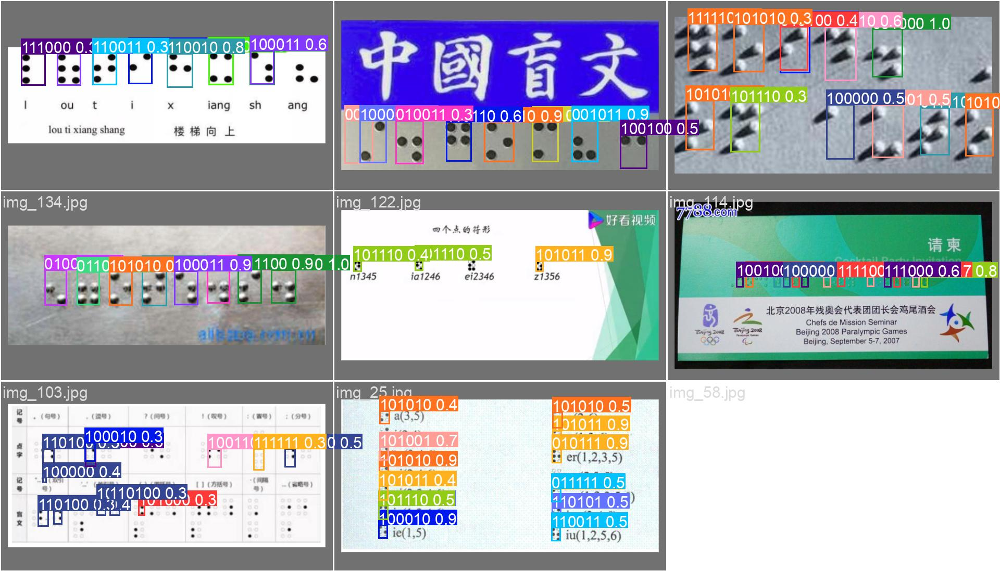
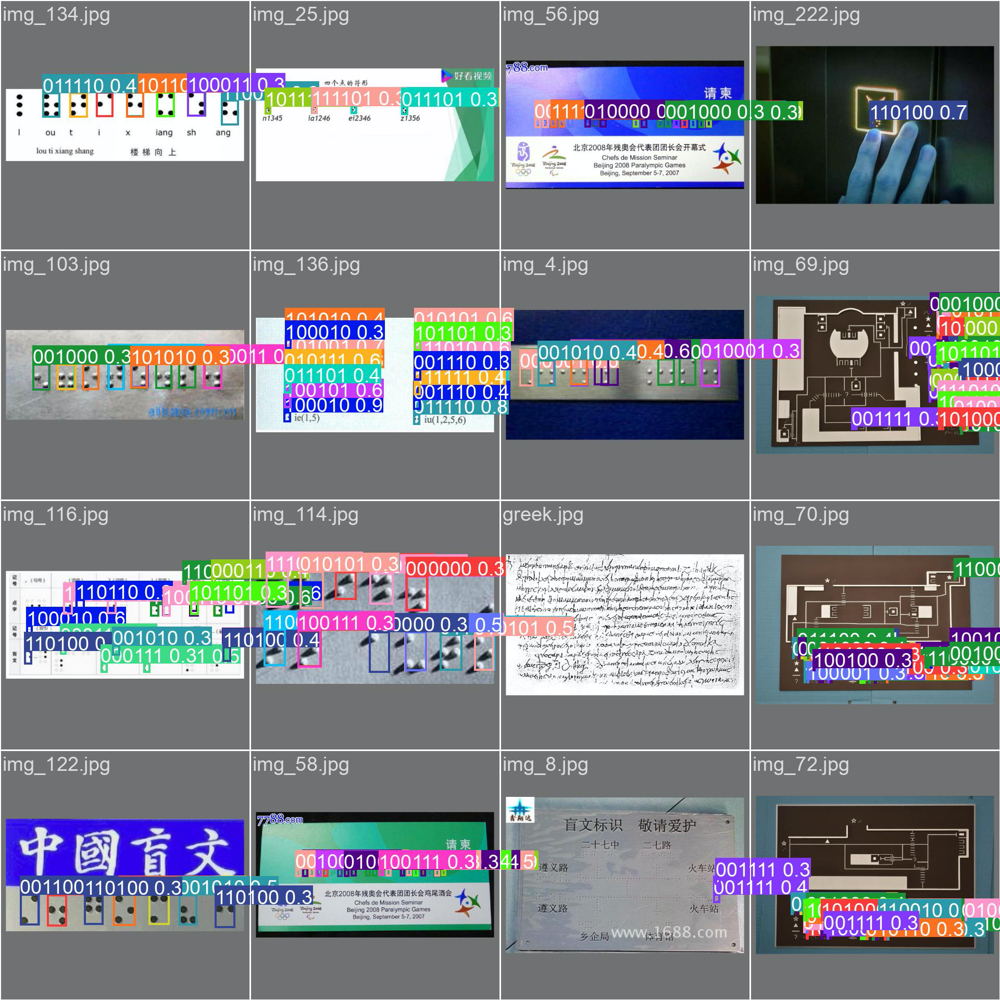
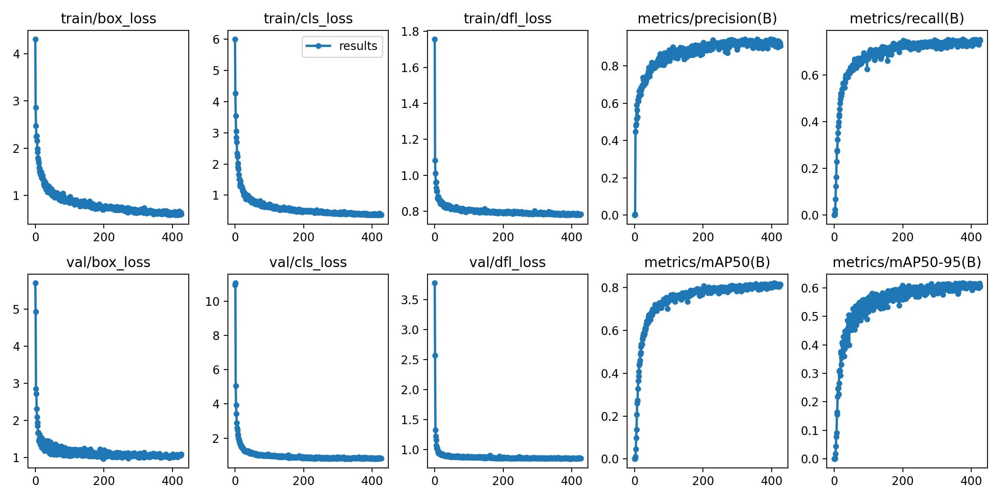
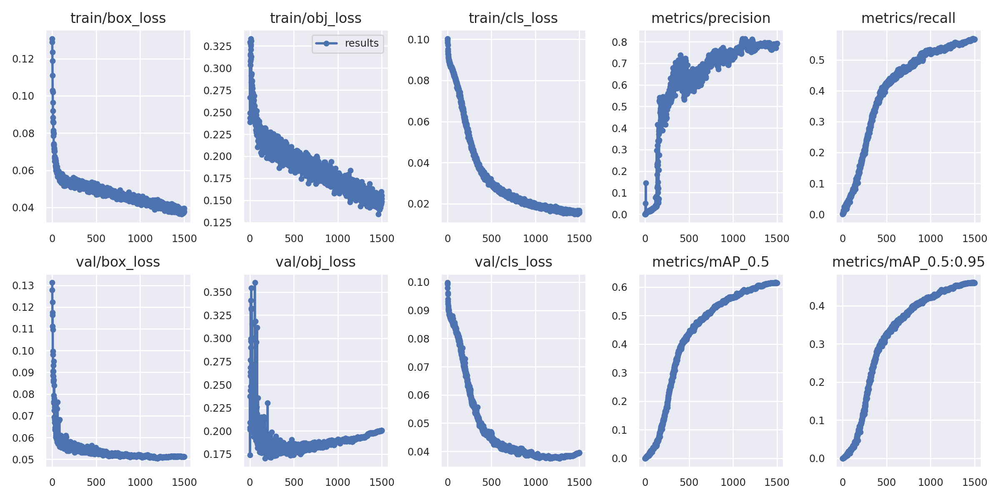

# DotNeuralNet

[](https://huggingface.co/spaces/snoop2head/braille-detection)

**Light-weight Neural Network for Optical Braille Recognition in the wild & on the book.**

- Classified multi label one-hot encoded labels for raised dots.
- Pseudo-labeled Natural Scene Braille symbols.
- Trained single stage object detection YOLO models for Braille symbols.

### Repository Structure

```
DotNeuralNet
ㄴ assets - example images and train/val logs
ㄴ dataset
  ㄴ AngelinaDataset - book background
  ㄴ braille_natural - natural scene background
  ㄴ DSBI - book background
  ㄴ KaggleDataset - arbitrary 6 dots
  ㄴ yolo.yaml - yolo dataset config
ㄴ src
  ㄴ utils
    ㄴ angelina_utils.py
    ㄴ braille_natural_utils.py
    ㄴ dsbi_utils.py
    ㄴ kaggle_utils.py
  ㄴ crop_bbox.py
  ㄴ dataset.py
  ㄴ model.py
  ㄴ pseudo_label.py
  ㄴ train.py
  ㄴ visualize.py
ㄴ weights
  ㄴ yolov5_braille.pt # yolov5-m checkpoint
  ㄴ yolov8_braille.pt # yolov8-m checkpoint
```

### Result

- Inferenced result of yolov8-m model on validation subset.
  
- Inferenced result of yolov5-m model on validation subset.
  

### Logs

- Train / Validation log of yolov8-m model
  
- Train / Validation log of yolov5-m model available at [🔗 WandB](https://wandb.ai/snoop2head/YOLOv5/runs/mqvmh4nc)
  

### Installation

CV2 and Yolo Dependency Installation

```shell
apt-get update && apt-get install ffmpeg libsm6 libxext6  -y
git clone https://github.com/ultralytics/yolov5  # clone
cd yolov5
pip install -r requirements.txt  # install
```

### How to Run

- Please refer to `src/inference.py` or `src/demo.py` to run the model. 
- For online demo, please visit [🔗 Streamlit demo](https://huggingface.co/spaces/snoop2head/braille-detection).

```python
import PIL
from ultralytics import YOLO
from convert import convert_to_braille_unicode, parse_xywh_and_class

def load_model(model_path):
    """load model from path"""
    model = YOLO(model_path)
    return model

def load_image(image_path):
    """load image from path"""
    image = PIL.Image.open(image_path)
    return image

# constants
CONF = 0.15 # or other desirable confidence threshold level
MODEL_PATH = "./weights/yolov8_braille.pt"
IMAGE_PATH = "./assets/alpha-numeric.jpeg"

# receiving results from the model
image = load_image(IMAGE_PATH)
model = YOLO(MODEL_PATH)
res = model.predict(image, save=True, save_txt=True, exist_ok=True, conf=CONF)
boxes = res[0].boxes  # first image
list_boxes = parse_xywh_and_class(boxes)

result = ""
for box_line in list_boxes:
    str_left_to_right = ""
    box_classes = box_line[:, -1]
    for each_class in box_classes:
        str_left_to_right += convert_to_braille_unicode(model.names[int(each_class)])
    result += str_left_to_right + "\n"

print(result)
```


### References

```
@article{Li2018DSBIDouble-SidedBraille,
    title   = {DSBI: Double-Sided Braille Image Dataset and Algorithm Evaluation for Braille Dots Detection},
    author  = {Renqiang Li, Hong Liu, Xiangdong Wan, Yueliang Qian},
    journal = {ArXiv},
    year    = {2018},
    volume  = {abs/1811.1089}
}
```

```
@article{Ovodov2021OpticalBrailleRecog,
    title   = {Optical Braille Recognition Using Object Detection CNN},
    author  = {Ilya G. Ovodov},
    journal = {2021 IEEE/CVF International Conference on Computer Vision Workshops},
    year    = {2021},
    pages   = {1741-1748}
}
```

```
@article{lu2022AnchorFreeBrailleCharac
    title   = {Anchor-Free Braille Character Detection Based on Edge Feature in Natural Scene Images},
    author  = {Liqiong Lu, Dong Wu, Jianfang Xiong, Zhou Liang and Faliang Huang},
    journal = {Computational Intelligence and Neuroscience},
    year    = {2022},
    url     = {https://www.hindawi.com/journals/cin/2022/7201775}
}
```
